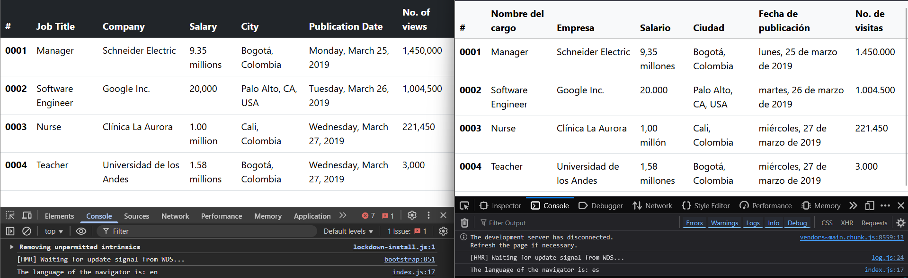

# Reto I18N

En la siguiente imagen se puede ver como se configura la información en la tabla dependiendo del idioma, español (`es`) o ingles (`en`). 

## Importante
**nota:** en la columna salario los millones se representan como decimal, por ende se utiliza el signo contrario al separador de miles para separar los decimales
